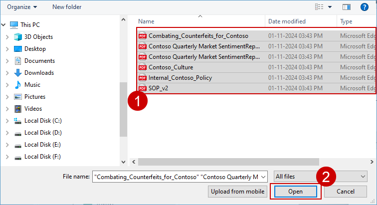
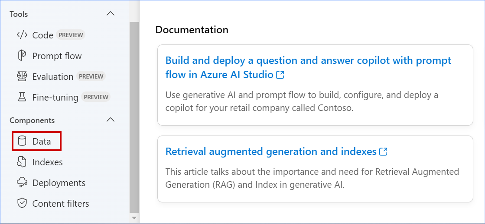
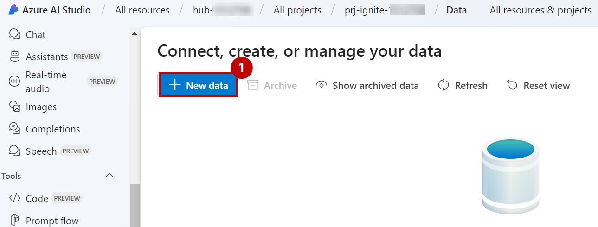
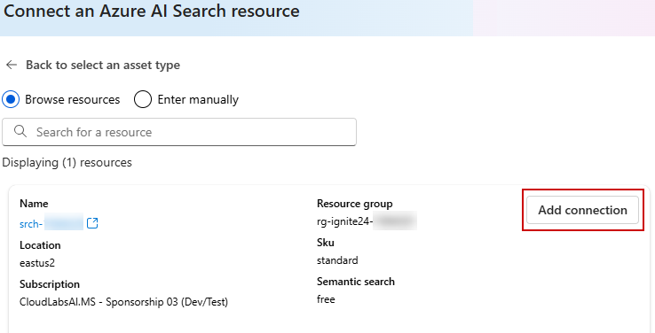

## Exercise 3: Building an AI-Powered Shopping Copilot with Microsoft Fabric and Azure AI Studio

### Task 3.1: Integrate Fabric data with Azure AI Studio using Azure AI Search and Vector Indexing for Hybrid Search

Let’s step into the shoes of Eva, the Data Engineer, as she launches Azure AI Studio and leverages data stored in Microsoft OneLake as knowledge base.


1. Navigate back to the Microsoft Fabric tab on your browser.
 
2. Click on **Workspaces** and select **<inject key= "WorkspaceName" enableCopy="false"/>**.
 

 
3. Click on **Filter** and select **Lakehouse**.
 

 
4. Click on the **lakehouse**.
 
>**Note:** There are 3 options for lakehouse, namely Lakehouse, Semantic model (Default) and SQL endpoint. Make sure you select the **Lakehouse** option.
 

 
5. Click on the three dots next to **Files** folder and select **New subfolder**.


 
6. Enter name of folder as **input** and click on **Create** button.
 


7. Click on the three dots next to the newly created folder **input** and select **Upload**, then **Upload files**.


 
8. In the Upload files window, click on the browse icon.


 
9. Navigate to path **C:\LabFiles\01_Pre_Day\artifacts\aistudio\input**, select all the files in the folder and click on **Open** button.


 
10. Click on **Upload** button.


 
11. Wait for the files to get uploaded and click on close button.


 
12. Click on the three dots next to the **input** folder and click on **Properties** then click on **Copy to clipboard** button next of the URL path and save it on your notepad.


13. Copy paste the below URL in the new browser tab to open Azure AI Studio Project.

``` BASH
<inject key= "project" enableCopy="true"/>
```

14. To connect with Fabric data scroll down in the left navigation pane and click on **Data**.



15. From the connect, create, or manage your data , click on **+ New Data**



16. Click on the drop down of **Data Source** and select **Get Data with Storage URL**.


17. Select service as **Microsoft OneLake** and paste the URL copied in **URL** field in the 12th step, then select **Microsoft Entra ID Based** in the **Authentication method** field and provide Connection name as **fabric_onelake** Click Next.

>**Note:** Remove **/Input** from the URL.


18. Select the **fabric_onelake** connection you created for  Data Source field and select the input folder and click on **Next**.


19. In the Data name field enter **input01** and click on **Create** button.


20. Once created, the **files** can be viewed under the input folder.


### Task 3.2 : Integrating Azure OpenAI to refine search results and deliver more precise, context-aware answers to users.

Contoso integrated all of their data sources using Microsoft Fabric, including customer feedback, sales records, social media interactions, and encompassing internal company policy documents such as SOPs and research articles on customer behavior into Azure AI Search. This created a unified, searchable knowledge base.. Let’s step into Data Engineer, Eva’s shoes to see how.

1. In Azure AI hub, select **Connections** from the left navigation pane and click on the **+ New Connection** button.

>**Note:** If the left side bar is collapsed, please click on **expand** from the above of the **left side bar**.


	
2. Select **Azure OpenAI Service**.


3. You will find two Azure OpenAI resources. Create a connection with both by clicking on the **Add connection** button.


4. Once the **OpenAI services are connected**, click on **Back to select an asset type**.


5. Select **Azure AI Search**.


6. Click on **Add connection**.



7. Once the **AI Search is connected**, click on the **Close** button.

>**Note:** If the **close** button is not visible, please reduce the screen size of the browser.


8. Here it is Azure Open AI and Azure AI Search Connections.


9. Click on **All projects** in the left navigation pane and select the **pre-created Project** displayed on your screen.
  


### Task 3.3 : Indexing data in Azure AI Studio, enabling efficient search and retrieval based on user queries.

Contoso indexed OneLake data in Azure AI Studio to improve the efficiency of searching and retrieving large datasets, enabling faster, data-driven decision-making across the organization. This approach enhances accessibility, scalability, and workflow for data scientists and analysts, while also providing a better user experience and reducing operational costs.. Let’s see how Eva, the Data Engineer, indexed OneLake data in Azure AI Studio.

1. Scroll down in the left navigation pane, click on **Indexes** and then click on the **+ New index** button.


2. In the Data source dropdown, select **Azure AI search**.


3. Click on the **Next** button.


4. In the Select Azure AI Search service dropdown, select **existing Azure AI Search service**.

5. In the Select Azure AI Search index dropdown, select **cosmosdb-index** and then click on the **Next** button.

>**Note:** If you get an error like "Unable to load search service indexes.Request failed with status code 403." please proceed by selecting Index.


6. In the Azure OpenAI connection dropdown, select **<inject key= "openai2" enableCopy="false"/>**.  and then click on the **Next** button.


7. Click on the **Next** button.


8. Click on the **Create vector index** button.


>**Note:** Please wait for the index to load.

9. A screen similar to the screenshot below will appear with the message **Index not found**. Please wait for some time and then click on **Indexes**.


10. Check the Status shown as **Ready** and continue with the next task.


### Task 3.4 : Deploying and testing a Prompt flow to automate query handling, ensuring quick and optimized responses.

Prompt flow in Azure AI Studio offers a comprehensive, streamlined environment for creating AI applications. It provides a visual interface for orchestrating flows, and enables iterative prompt engineering. Azure AI Studio includes built-in evaluation tools, seamless deployment options, and integration with Azure's ecosystem. It also offers enterprise-level security and scalability, making it ideal for developing, testing, and deploying sophisticated AI solutions efficiently. Let’s explore how Contoso deployed and tested a Prompt flow.

1. Click on **Prompt flow** from the left navigation pane and then click on the **+ Create** button.


2. Scroll down and click on the **Upload** button in the Upload from local section.


3. Click on the **Zip file** radio button and then click on **Browse**.


4. Navigate to the path **C:\LabFiles\01_Pre_Day\artifacts\aistudio**, by clicking on the **browse** button.

5. Click on **shopping-assistant-prompt-flow** and then click on the **Open** button.

   

6. In the Select flow type dropdown, select **Chat flow** and then click on the **Upload** button.


>**Note:** If clicking on the upload button doesn't redirect you to the Prompt flow screen, click on the Upload button and retry. You might need to do this for twice or thrice.

7. Click on the **Start compute session** button.

>**Note:** It will take approximately 2-3 minutes to start the compute session. Please wait for some time.


8. Scroll down to the **lookup** section in the Prompt flow graph and click on it.

9. Click on the **Validate and prase input** button.

10. Once it is validated, click on edit option for **mlindex_content** as shown in the below screenshot.


11. Click on the **acs_index_connection** dropdown and select the **srch....**.

12. Click on the **acs_index_name** dropdown and select the **cosmosdb-index**.

13. Click on the **embedding_type** dropdown and select the **Azure OpenAI**.

14. Click on the **aoai_embedding_connection** dropdown and select the **<inject key= "openai2" enableCopy="false"/>**.

15. Click on the **Save** button.


16. Click on **prompt_for_looks** in the Graph and then click on the **Validate and prase input** button in the Input sections. 


17. Once it is validated, click on the **Connection** dropdown and then select **<inject key= "openai" enableCopy="false"/>**.


18. Click on **max_token**, remove the preset token, and set it to **100**.


19. Click on the **Chat** button.


20. Paste the **below question** in chat box replacing the default question.

```
Can you show me some yellow indian dresses for a wedding in Udaipur?
```
21. Click on the **send** icon.


22. Observe the **response**.


Once the Prompt flow is deployed as an endpoint, It can be consumed in the webapplication. Let's see how the response look like in the webapp.
 
23. Copy the below URL and paste it in the browser new tab.

```BASH
<inject key= "shoppingcopilotwebapp" enableCopy="false"/>
```

24. Click on the **terms and conditions checkbox** and then click on the **Login** button.


 
25. Click on the **Copilot icon** at the bottom right of the page.
 


26. Click on any of the **pre-populated questions**.
 

 
27. Observe the **response**.
  

 
With their new Shopping Copilot, Contoso was able to provide their customers with an online shopping experience that has an in-store feel. This simulates a personalized shopping experience that helps increase customers’ engagement with enhanced data insights.
