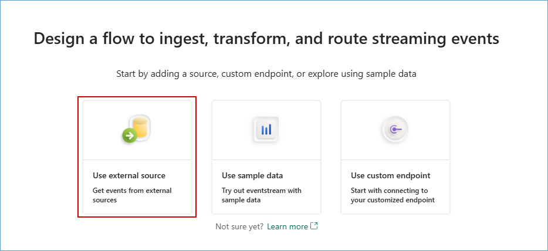
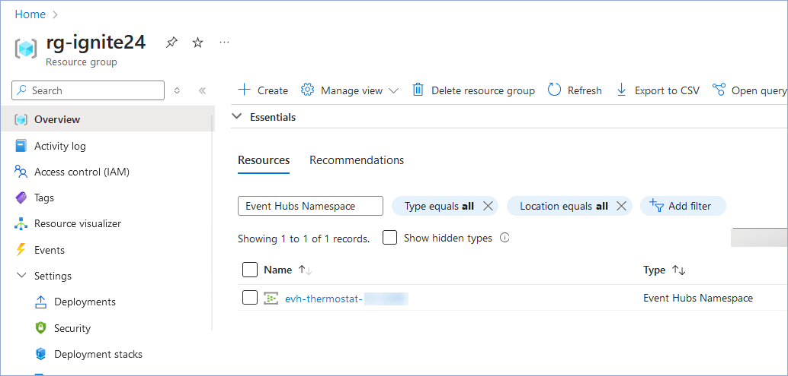
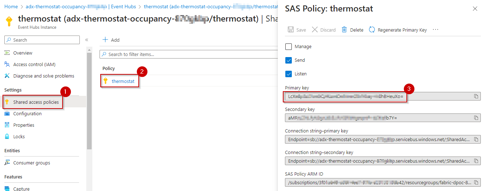
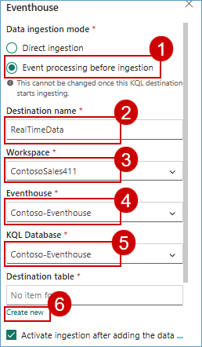

### Exercise 5: Real-time Intelligence experience - Explore Streaming data using Copilot for KQL DB

Imagine, it is 6 am on the day of Contoso's big Thanksgiving sale. Customers are flocking to their stores in large numbers. We are about to witness the very culmination of Contoso's phenomenal transformation with Microsoft Fabric and Azure Databricks. Specifically, we will see how near real-time data is used to make decisions for the next moment in Contoso's stores to ensure optimal temperatures are maintained for their customers while they shop at the big sale!

### Task 5.1: Ingest real-time/historical data into Eventhouse using Eventstream


In the exercise, we’ll explore how Data Engineer, Eva, ingested real-time data from the event hub into the KQL Database to monitor in-store temperatures in real time.

1. Click on the **experience** button at the **bottom left** corner of the screen (In this screenshot, **Data Factory** is selected as an "Experience") and then select **Real-Time Intelligence**.


>**Note:** If you see a pop-up like the one below, click on the **Don't save** button.

 

2. On the Real-Time Intelligence experience screen, click on **Eventhouse**.


3. Enter the name "Contoso-Eventhouse".

```
Contoso-Eventhouse
```

4. Click on the **Create** button and wait for the database to be created.


>**Note:** If you see a **pop-up** like the one in the screenshot below, ignore it and proceed with the next step.


5. Click on the **experience** button at the **bottom left** corner of the screen (In this screenshot, **Real-Time Intelligence** is selected as an "Experience") and then select **Real-Time Intelligence**.


6. click on **Eventstream** button.


7. Enter the name as **RealtimeDataTo-KQL-DB** and tick a checkbox **Enhanced Capabilities(preview)** then click on **Create** button.

```
RealtimeDataTo-KQL-DB
```


8. Click on the **Use external source** button.



9. Click on the **Azure Event Hubs connect** button.


10. Under the Connection field, click on **New connection**.


11. Enter the value for the **Event Hub namespace** as <inject key="eventhubNamespace" enableCopy="false"/> and enter the **Event Hub** value as **thermostat**.

```BASH
<inject key="eventhubNamespace" enableCopy="true"/>
```

```
thermostat
```


12. Navigate back to the Resource Group <inject key="resourcegroup" enableCopy="false"/> in the Azure Portal, and search for "Event Hubs Namespace" and click on **<inject key="eventhubNamespace" enableCopy="false"/>**.



13. Scroll down in the left navigation pane and click on Event Hubs under the Entities section.


14. Click on the **thermostat event hub**.


15. Click on **Shared access policies** in the left pane under Settings, then click on **thermostat** and finally copy the **primary key** and paste it in a notepad for further use.

>**Note:** Expand the **settings** option if the left navigations are collapsed.



16. Go back to the **Microsoft Fabric** and scroll down and select **Shared Access Key** for Authentication kind, enter the Shared Access Key Name as **thermostat** and then Enter the value copied in the earlier step for **Shared Access Key** and then click on the **Connect** button.

```
thermostat
```

>**Note:** Close any pop-up that appears on the screen.


>**Note:** Close any pop-up which appears on screen.


17. Select Data format as **JSON** and click on **Next** button.


>**Note:** Wait for the connection to be established.

18. Click on the **Add** button.


19. In the Eventstream canvas, click on the **Add destination** dropdown and select **Eventhouse**.


20. Select the **Event processing before ingestion** radio button, enter "RealTimeData" as the Destination name.

```
RealTimeData
```

21. In the **Workspace** field select <inject key="WorkspaceName" enableCopy="false"/>. 

22. In the **Eventhouse** dropdown select **Contoso-Eventhouse**.

23. In the **KQL Database** dropdown select **Contoso-Eventhouse**.

24. Click on the **Create new** button.



25. Enter the table name as **thermostat** and then click on the **Done** button.

```
thermostat
```


26. Enter the Input data format as **Json**.

>**Note:** Zoom-out on your screen if the **Input data format field** is not visible.


27. Drag Arrow from **RealtimeDataTo-KQL** and connect it to **RealTimeData**.


28. Click on the **Publish** button.


>**Note:** Wait for the data ingestion from EventHub to KQL DB.

29. Once you see that the streaming has started, click on **Refresh** and wait for the data to preview.


Real-time data from the event hub has been ingested successfully into the KQL Database. Next, as customers walk in aisles and the temperatures fluctuate, let us see how KQL queries proactively identify anomalies and help maintain an optimal shopping experience!


### Task 5.2: Analyze/discover patterns, identify anomalies and outliers using Copilot

Kusto Query Language is a powerful tool. In this scenario KQL is used to explore Contoso’s data, discover patterns, identify anomalies and outliers, create statistical modeling, and more.

We use KQL to query the thermostat data that’s streaming in near real-time from the devices installed in Contoso’s stores.

1. Click on **Workspaces** and select <inject key="WorkspaceName" enableCopy="false"/> workspace from the left navigation pane.


2. Click on the **experience** button at the **bottom left** corner of the screen (In this screenshot, **Real-Time Intelligence** is selected as an "Experience") and then select **Real-Time Intelligence**.


3. Click on **KQL Queryset** button.


4. In the KQL Queryset name field, "Query Thermostat Data in Near Real-time using KQL Script" and click on the **Create** button.

```
Query Thermostat Data in Near Real-time using KQL Script
```


5. **Wait** for the query set creation and a new screen will display. In this screen, click on **Contoso-Eventhouse**, verify the workspace name and then click on the **Connect** button.


6. Place your cursor inside the **query** field, select all using **Ctrl + A** and **delete** the pre-written query.


7. Click on the **Copilot** button.


8. **Paste** the query provided below in the Copilot query section.

```
Create a query to summarize average temperature every 1 min in line chart
```

9. Click on the **Send** icon.

>**Note:** The responses from Copilot may not match the ones in the screenshot but will provide a similar response. 

10. Click on the **Insert** button.


11. Place you cursor in the **script field**, click on the **Run** button and you get the desired result.


Imagine one of the aisles had a sudden rise in temperature due to an anomaly. Customers start leaving that aisle and the wait times in the checkout lines start to increase but thanks to the KQL Queries, those anomalies would be tracked, and immediately notifications would be generated to bring the aisle temperature back to optimal levels!
